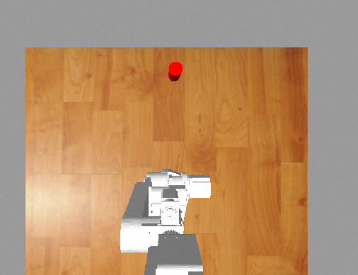

# Tracking Object Using AR3 

>   使用gazebo進行機械手臂的模擬,使用虛擬的相機追蹤紅色圓餅
>
>   範例影片:https://youtu.be/I3fZvniRASY?si=t_qzXC1Y9PwcZHjk


## 虛擬硬體環境配置

> VMware Workstation17

`RAM:13.4GB `

`Disk:60GB`

`Processors:8`


## 軟體配置

`ubuntu18.04.6LTS `

`ROS melodic`

## 版本說明
* 手臂追蹤功能已完成(手眼校正、opencv追蹤、座標轉換)
* 圓餅被手臂遮住情況下無法辨識
* 正在開發真空夾爪(vacumm gripper),目前遇到物件偏移現象
* StackRadCylinder堆疊紅色圓餅正在進行中


## demo
第一個終端機
```bash
    cd /
    mkdir ar3_ws
    cd ar3_ws/
    git clone https://github.com/edwards414/TrackingObjectUsingAR3.git
    catkin build
    source devel/setup.bash
    roslaunch ar3_gazebo ar3_gazebo_bringup.launch
```
第二個終端機(Ctrl+Shift+t)
```bash
   source devel/setup.bash
   rosrun ar3_control control_demo
```

## 座標轉換過程


RVIZ中使用TF座標可以看見相機的位置,也可以看見相對於相機原點哪邊是xyz方向(顏色對應xyz = rgb)


## 圖像座標轉成相機座標
這段代碼 使用比例尺轉成相機座標,找出圓形佔圖片多少個像素,在gazebo虛擬環境我們可以直接知道實物大小,透過兩者轉換可以直接換算出相機座標,在圖像座標下左上角是原點(0,0)需要將它換成以中央為圓點的座標。 
```cpp
float pixels_permm = 19.0f/0.05f;

void Ar3Control::convertToMM(float &x , float &y){
    /**
     * @brief gazebo camera image row and col
     *
     * @param paramter image_center_x image_center_y
     */
    float image_center_x = 640.0/2.0f;
    float image_center_y = 480.0/2.0f;
    x = (x - image_center_x)/pixels_permm;
    y = (y - image_center_y)/pixels_permm;
}

```


## 手眼校正(Hand-Eye Calibration)
設相機的安裝方式分成兩種,相機定點、手臂末端相機,我使用的方式是相機定點,透過tf座標轉換可以直接求出對應矩陣

使用外參設定,透過tf座標轉換知道各個軸的對應矩陣
```cpp
    this->tf_camera_to_robot.lookupTransform("/base_link", "/camera_link", ros::Time(0), (this->camera_to_robot_));
```

相機到手臂的對應矩陣乘以相機座標就會得出"機械手臂座標"

```cpp
    obj_robot_frame = camera_to_robot_ * obj_camera_frame;
```


## 來源

 - [billbill手臂教程](https://www.bilibili.com/video/BV1Mg4y127Z9/?spm_id_from=333.337.search-card.all.click&vd_source=53c21729b38d8f6e3089a9d719e99479)

 - [ar3 urdf](https://github.com/ongdexter/ar3_core/tree/master)


